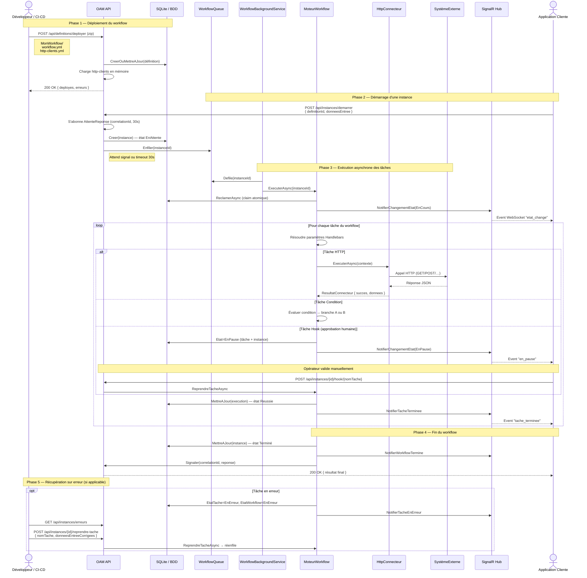
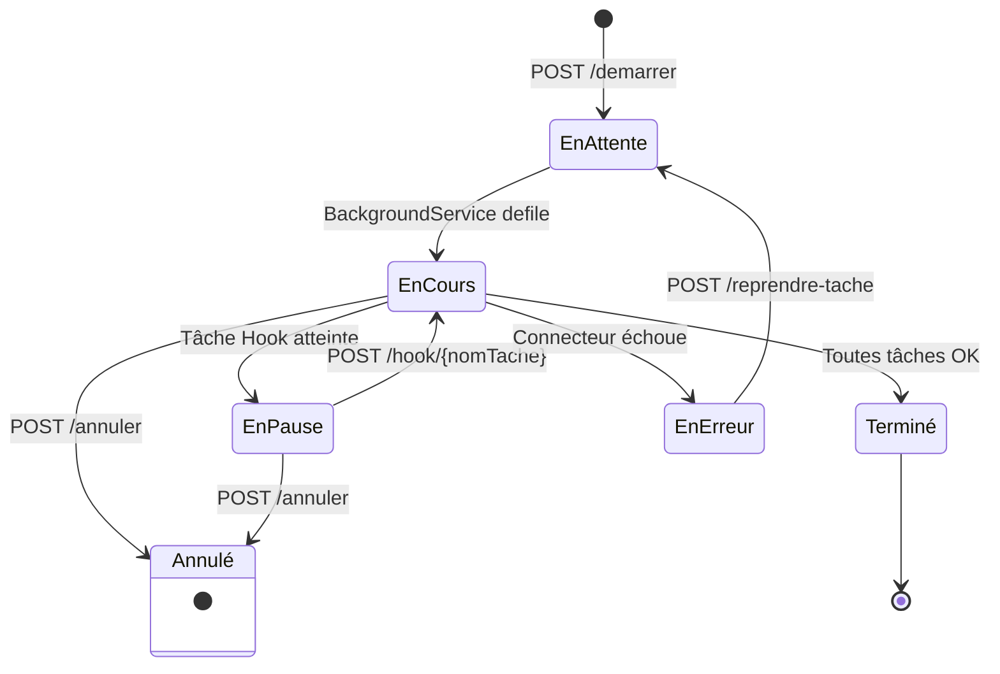
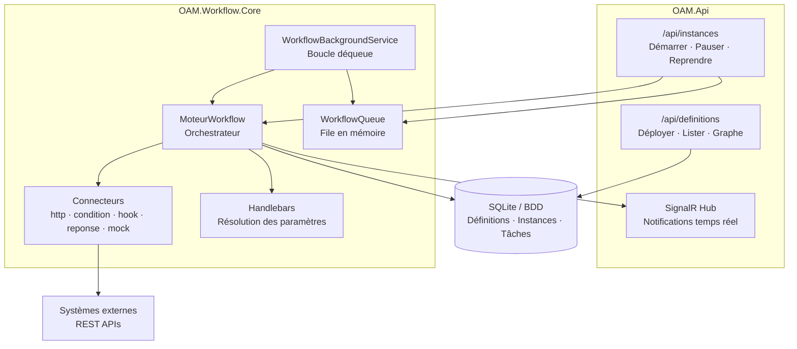

# Utilisation typique d'OAM en production

## Flux complet : déploiement → exécution → résultat

```mermaid
sequenceDiagram
    actor Dev as Développeur / CI-CD
    participant API as OAM API
    participant DB as SQLite / BDD
    participant Queue as WorkflowQueue
    participant BG as WorkflowBackgroundService
    participant Moteur as MoteurWorkflow
    participant HTTP as HttpConnecteur
    participant SRE as SystèmeExterne
    participant Hub as SignalR Hub
    actor Client as Application Cliente

    %% ── Phase 1 : Déploiement ──────────────────────────────────────────
    Note over Dev,DB: Phase 1 — Déploiement du workflow
    Dev->>API: POST /api/definitions/deployer (zip)
    Note right of Dev: MonWorkflow/<br/>  workflow.yml<br/>  http-clients.yml
    API->>DB: CreerOuMettreAJour(définition)
    API->>API: Charge http-clients en mémoire
    API-->>Dev: 200 OK { deployes, erreurs }

    %% ── Phase 2 : Démarrage ────────────────────────────────────────────
    Note over Client,Queue: Phase 2 — Démarrage d'une instance
    Client->>API: POST /api/instances/demarrer<br/>{ definitionId, donneesEntree }
    API->>API: S'abonne AttenteReponse (correlationId, 30s)
    API->>DB: Creer(instance) — état EnAttente
    API->>Queue: Enfiler(instanceId)
    Note right of API: Attend signal ou timeout 30s

    %% ── Phase 3 : Exécution ────────────────────────────────────────────
    Note over BG,SRE: Phase 3 — Exécution asynchrone des tâches
    BG->>Queue: Defile(instanceId)
    BG->>Moteur: ExecuterAsync(instanceId)
    Moteur->>DB: ReclamerAsync (claim atomique)
    Moteur->>Hub: NotifierChangementEtat(EnCours)
    Hub-->>Client: Event WebSocket "etat_change"

    loop Pour chaque tâche du workflow
        Moteur->>Moteur: Résoudre paramètres Handlebars
        alt Tâche HTTP
            Moteur->>HTTP: ExecuterAsync(contexte)
            HTTP->>SRE: Appel HTTP (GET/POST/…)
            SRE-->>HTTP: Réponse JSON
            HTTP-->>Moteur: ResultatConnecteur { succes, donnees }
        else Tâche Condition
            Moteur->>Moteur: Évaluer condition → branche A ou B
        else Tâche Hook (approbation humaine)
            Moteur->>DB: Etat=EnPause (tâche + instance)
            Moteur->>Hub: NotifierChangementEtat(EnPause)
            Hub-->>Client: Event "en_pause"
            Note over Client,API: Opérateur valide manuellement
            Client->>API: POST /api/instances/{id}/hook/{nomTache}
            API->>Moteur: ReprendreTacheAsync
        end
        Moteur->>DB: MettreAJour(execution) — état Reussie
        Moteur->>Hub: NotifierTacheTerminee
        Hub-->>Client: Event "tache_terminee"
    end

    %% ── Phase 4 : Fin ──────────────────────────────────────────────────
    Note over Moteur,Client: Phase 4 — Fin du workflow
    Moteur->>DB: MettreAJour(instance) — état Terminé
    Moteur->>Hub: NotifierWorkflowTermine
    Moteur->>API: Signaler(correlationId, reponse)
    API-->>Client: 200 OK { résultat final }

    %% ── Phase 5 : Gestion d'erreur ────────────────────────────────────
    Note over Dev,API: Phase 5 — Récupération sur erreur (si applicable)
    opt Tâche en erreur
        Moteur->>DB: EtatTache=EnErreur, EtatWorkflow=EnErreur
        Moteur->>Hub: NotifierTacheEnErreur
        Dev->>API: GET /api/instances/erreurs
        Dev->>API: POST /api/instances/{id}/reprendre-tache<br/>{ nomTache, donneesEntreeCorrigees }
        API->>Moteur: ReprendreTacheAsync → réenfile
    end
```

## Cas d'usage : approbation humaine (Hook)

```mermaid
stateDiagram-v2
    [*] --> EnAttente : POST /demarrer
    EnAttente --> EnCours : BackgroundService defile
    EnCours --> EnPause : Tâche Hook atteinte
    EnPause --> EnCours : POST /hook/{nomTache}
    EnCours --> Terminé : Toutes tâches OK
    EnCours --> EnErreur : Connecteur échoue
    EnErreur --> EnAttente : POST /reprendre-tache
    Terminé --> [*]
    state Annulé {
        [*]
    }
    EnCours --> Annulé : POST /annuler
    EnPause --> Annulé : POST /annuler
```

## Composants clés

```mermaid
graph TD
    subgraph API["OAM.Api"]
        DEF["/api/definitions<br/>Déployer · Lister · Graphe"]
        INST["/api/instances<br/>Démarrer · Pauser · Reprendre"]
        HUB["SignalR Hub<br/>Notifications temps réel"]
    end

    subgraph CORE["OAM.Workflow.Core"]
        MOTEUR["MoteurWorkflow<br/>Orchestrateur"]
        QUEUE["WorkflowQueue<br/>File en mémoire"]
        BG["WorkflowBackgroundService<br/>Boucle déqueue"]
        CONN["Connecteurs<br/>http · condition · hook · reponse · mock"]
        HB["Handlebars<br/>Résolution des paramètres"]
    end

    DB[("SQLite / BDD<br/>Définitions · Instances · Tâches")]
    EXT["Systèmes externes<br/>REST APIs"]

    DEF --> DB
    INST --> QUEUE
    INST --> MOTEUR
    BG --> QUEUE
    BG --> MOTEUR
    MOTEUR --> CONN
    MOTEUR --> HB
    MOTEUR --> DB
    MOTEUR --> HUB
    CONN --> EXT
```
