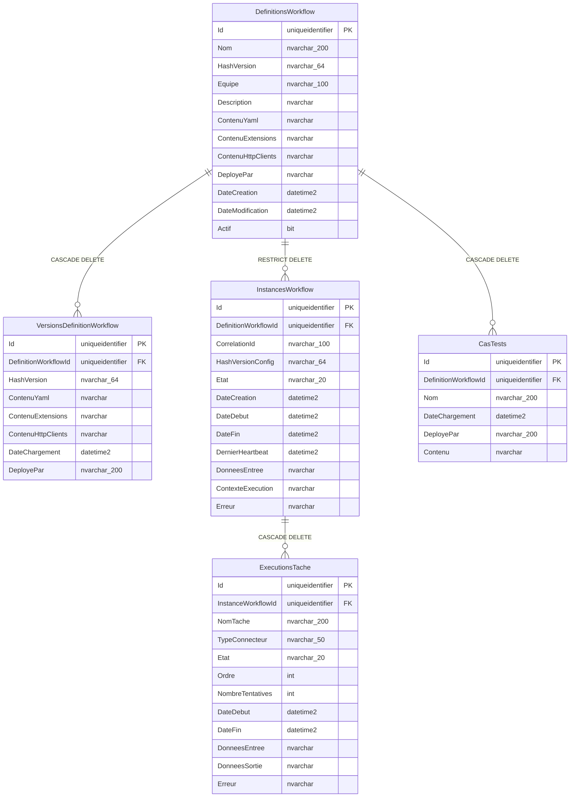

# Schéma SQL — OAM

> Généré depuis les entités Entity Framework Core (`src/OAM.Domain/Entities/` + `src/OAM.Infrastructure/Data/OamDbContext.cs`)  
> Moteurs supportés : **SQL Server** (principal) · **SQLite** (fallback)

---

## Tables

### `DefinitionsWorkflow`

| Colonne | Type SQL | Nullable | Défaut | Notes |
|---------|----------|----------|--------|-------|
| `Id` | `UNIQUEIDENTIFIER` | NON | `NEWID()` | Clé primaire |
| `Nom` | `NVARCHAR(200)` | NON | — | Index unique |
| `Description` | `NVARCHAR(MAX)` | OUI | — | |
| `ContenuYaml` | `NVARCHAR(MAX)` | NON | — | Structure YAML du workflow |
| `ContenuExtensions` | `NVARCHAR(MAX)` | OUI | — | |
| `ContenuHttpClients` | `NVARCHAR(MAX)` | OUI | — | |
| `HashVersion` | `NVARCHAR(64)` | NON | — | Index, identifiant de version |
| `Equipe` | `NVARCHAR(100)` | OUI | — | |
| `DeployePar` | `NVARCHAR(MAX)` | OUI | — | |
| `DateCreation` | `DATETIME2` | NON | `GETUTCDATE()` | |
| `DateModification` | `DATETIME2` | NON | `GETUTCDATE()` | |
| `Actif` | `BIT` | NON | `1` | |

```sql
CREATE TABLE DefinitionsWorkflow (
    Id                  UNIQUEIDENTIFIER    NOT NULL DEFAULT NEWID(),
    Nom                 NVARCHAR(200)       NOT NULL,
    Description         NVARCHAR(MAX)           NULL,
    ContenuYaml         NVARCHAR(MAX)       NOT NULL,
    ContenuExtensions   NVARCHAR(MAX)           NULL,
    ContenuHttpClients  NVARCHAR(MAX)           NULL,
    HashVersion         NVARCHAR(64)        NOT NULL,
    Equipe              NVARCHAR(100)           NULL,
    DeployePar          NVARCHAR(MAX)           NULL,
    DateCreation        DATETIME2           NOT NULL DEFAULT GETUTCDATE(),
    DateModification    DATETIME2           NOT NULL DEFAULT GETUTCDATE(),
    Actif               BIT                 NOT NULL DEFAULT 1,

    CONSTRAINT PK_DefinitionsWorkflow PRIMARY KEY (Id)
);

CREATE UNIQUE INDEX IX_DefinitionsWorkflow_Nom         ON DefinitionsWorkflow (Nom);
CREATE        INDEX IX_DefinitionsWorkflow_HashVersion  ON DefinitionsWorkflow (HashVersion);
```

---

### `VersionsDefinitionWorkflow`

| Colonne | Type SQL | Nullable | Défaut | Notes |
|---------|----------|----------|--------|-------|
| `Id` | `UNIQUEIDENTIFIER` | NON | `NEWID()` | Clé primaire |
| `DefinitionWorkflowId` | `UNIQUEIDENTIFIER` | NON | — | FK → `DefinitionsWorkflow`, cascade delete |
| `HashVersion` | `NVARCHAR(64)` | NON | — | Index |
| `ContenuYaml` | `NVARCHAR(MAX)` | NON | — | |
| `ContenuExtensions` | `NVARCHAR(MAX)` | OUI | — | |
| `ContenuHttpClients` | `NVARCHAR(MAX)` | OUI | — | |
| `DateChargement` | `DATETIME2` | NON | `GETUTCDATE()` | |
| `DeployePar` | `NVARCHAR(200)` | OUI | — | |

```sql
CREATE TABLE VersionsDefinitionWorkflow (
    Id                    UNIQUEIDENTIFIER    NOT NULL DEFAULT NEWID(),
    DefinitionWorkflowId  UNIQUEIDENTIFIER    NOT NULL,
    HashVersion           NVARCHAR(64)        NOT NULL,
    ContenuYaml           NVARCHAR(MAX)       NOT NULL,
    ContenuExtensions     NVARCHAR(MAX)           NULL,
    ContenuHttpClients    NVARCHAR(MAX)           NULL,
    DateChargement        DATETIME2           NOT NULL DEFAULT GETUTCDATE(),
    DeployePar            NVARCHAR(200)           NULL,

    CONSTRAINT PK_VersionsDefinitionWorkflow
        PRIMARY KEY (Id),
    CONSTRAINT FK_VersionsDefinitionWorkflow_DefinitionsWorkflow
        FOREIGN KEY (DefinitionWorkflowId)
        REFERENCES DefinitionsWorkflow (Id)
        ON DELETE CASCADE
);

CREATE INDEX IX_VersionsDefinitionWorkflow_HashVersion ON VersionsDefinitionWorkflow (HashVersion);
```

---

### `InstancesWorkflow`

| Colonne | Type SQL | Nullable | Défaut | Notes |
|---------|----------|----------|--------|-------|
| `Id` | `UNIQUEIDENTIFIER` | NON | `NEWID()` | Clé primaire |
| `DefinitionWorkflowId` | `UNIQUEIDENTIFIER` | NON | — | FK → `DefinitionsWorkflow`, restrict delete |
| `CorrelationId` | `NVARCHAR(100)` | NON | — | Index, identifiant d'exécution |
| `HashVersionConfig` | `NVARCHAR(64)` | NON | — | |
| `Etat` | `NVARCHAR(20)` | NON | — | Index, enum `EtatWorkflow` |
| `DonneesEntree` | `NVARCHAR(MAX)` | OUI | — | JSON |
| `ContexteExecution` | `NVARCHAR(MAX)` | OUI | — | |
| `DateCreation` | `DATETIME2` | NON | `GETUTCDATE()` | |
| `DateDebut` | `DATETIME2` | OUI | — | |
| `DateFin` | `DATETIME2` | OUI | — | |
| `DernierHeartbeat` | `DATETIME2` | OUI | — | Index |
| `Erreur` | `NVARCHAR(MAX)` | OUI | — | |

```sql
CREATE TABLE InstancesWorkflow (
    Id                    UNIQUEIDENTIFIER    NOT NULL DEFAULT NEWID(),
    DefinitionWorkflowId  UNIQUEIDENTIFIER    NOT NULL,
    CorrelationId         NVARCHAR(100)       NOT NULL,
    HashVersionConfig     NVARCHAR(64)        NOT NULL,
    Etat                  NVARCHAR(20)        NOT NULL,  -- EnAttente | EnCours | EnPause | EnErreur | Termine | Annule
    DonneesEntree         NVARCHAR(MAX)           NULL,
    ContexteExecution     NVARCHAR(MAX)           NULL,
    DateCreation          DATETIME2           NOT NULL DEFAULT GETUTCDATE(),
    DateDebut             DATETIME2               NULL,
    DateFin               DATETIME2               NULL,
    DernierHeartbeat      DATETIME2               NULL,
    Erreur                NVARCHAR(MAX)           NULL,

    CONSTRAINT PK_InstancesWorkflow
        PRIMARY KEY (Id),
    CONSTRAINT FK_InstancesWorkflow_DefinitionsWorkflow
        FOREIGN KEY (DefinitionWorkflowId)
        REFERENCES DefinitionsWorkflow (Id)
        ON DELETE NO ACTION  -- RESTRICT
);

CREATE INDEX IX_InstancesWorkflow_CorrelationId     ON InstancesWorkflow (CorrelationId);
CREATE INDEX IX_InstancesWorkflow_Etat              ON InstancesWorkflow (Etat);
CREATE INDEX IX_InstancesWorkflow_DernierHeartbeat  ON InstancesWorkflow (DernierHeartbeat);
```

---

### `ExecutionsTache`

| Colonne | Type SQL | Nullable | Défaut | Notes |
|---------|----------|----------|--------|-------|
| `Id` | `UNIQUEIDENTIFIER` | NON | `NEWID()` | Clé primaire |
| `InstanceWorkflowId` | `UNIQUEIDENTIFIER` | NON | — | FK → `InstancesWorkflow`, cascade delete, index composite |
| `NomTache` | `NVARCHAR(200)` | NON | — | Index composite avec `InstanceWorkflowId` |
| `TypeConnecteur` | `NVARCHAR(50)` | NON | — | Enum `TypeConnecteur` |
| `Ordre` | `INT` | NON | — | Ordre d'exécution |
| `Etat` | `NVARCHAR(20)` | NON | — | Enum `EtatTache` |
| `DonneesEntree` | `NVARCHAR(MAX)` | OUI | — | |
| `DonneesSortie` | `NVARCHAR(MAX)` | OUI | — | |
| `Erreur` | `NVARCHAR(MAX)` | OUI | — | |
| `DateDebut` | `DATETIME2` | OUI | — | |
| `DateFin` | `DATETIME2` | OUI | — | |
| `NombreTentatives` | `INT` | NON | `0` | Compteur de retry |

```sql
CREATE TABLE ExecutionsTache (
    Id                  UNIQUEIDENTIFIER    NOT NULL DEFAULT NEWID(),
    InstanceWorkflowId  UNIQUEIDENTIFIER    NOT NULL,
    NomTache            NVARCHAR(200)       NOT NULL,
    TypeConnecteur      NVARCHAR(50)        NOT NULL,  -- Http | PubSub | Mdat | Mock | Condition | Boucle | Hook
    Ordre               INT                 NOT NULL,
    Etat                NVARCHAR(20)        NOT NULL,  -- EnAttente | EnCours | Reussie | EnErreur | Ignoree | EnPause
    DonneesEntree       NVARCHAR(MAX)           NULL,
    DonneesSortie       NVARCHAR(MAX)           NULL,
    Erreur              NVARCHAR(MAX)           NULL,
    DateDebut           DATETIME2               NULL,
    DateFin             DATETIME2               NULL,
    NombreTentatives    INT                 NOT NULL DEFAULT 0,

    CONSTRAINT PK_ExecutionsTache
        PRIMARY KEY (Id),
    CONSTRAINT FK_ExecutionsTache_InstancesWorkflow
        FOREIGN KEY (InstanceWorkflowId)
        REFERENCES InstancesWorkflow (Id)
        ON DELETE CASCADE
);

CREATE INDEX IX_ExecutionsTache_InstanceWorkflowId_NomTache
    ON ExecutionsTache (InstanceWorkflowId, NomTache);
```

---

### `CasTests`

| Colonne | Type SQL | Nullable | Défaut | Notes |
|---------|----------|----------|--------|-------|
| `Id` | `UNIQUEIDENTIFIER` | NON | `NEWID()` | Clé primaire |
| `DefinitionWorkflowId` | `UNIQUEIDENTIFIER` | NON | — | FK → `DefinitionsWorkflow`, cascade delete, index composite unique |
| `Nom` | `NVARCHAR(200)` | NON | — | Index composite unique avec `DefinitionWorkflowId` |
| `Contenu` | `NVARCHAR(MAX)` | NON | — | Contenu du cas de test |
| `DateChargement` | `DATETIME2` | NON | `GETUTCDATE()` | |
| `DeployePar` | `NVARCHAR(200)` | OUI | — | |

```sql
CREATE TABLE CasTests (
    Id                    UNIQUEIDENTIFIER    NOT NULL DEFAULT NEWID(),
    DefinitionWorkflowId  UNIQUEIDENTIFIER    NOT NULL,
    Nom                   NVARCHAR(200)       NOT NULL,
    Contenu               NVARCHAR(MAX)       NOT NULL,
    DateChargement        DATETIME2           NOT NULL DEFAULT GETUTCDATE(),
    DeployePar            NVARCHAR(200)           NULL,

    CONSTRAINT PK_CasTests
        PRIMARY KEY (Id),
    CONSTRAINT FK_CasTests_DefinitionsWorkflow
        FOREIGN KEY (DefinitionWorkflowId)
        REFERENCES DefinitionsWorkflow (Id)
        ON DELETE CASCADE
);

CREATE UNIQUE INDEX IX_CasTests_DefinitionWorkflowId_Nom
    ON CasTests (DefinitionWorkflowId, Nom);
```

---

## Diagramme des relations



---

## Énumérations (stockées en string)

| Enum | Valeurs | Colonne |
|------|---------|---------|
| `EtatWorkflow` | `EnAttente`, `EnCours`, `EnPause`, `EnErreur`, `Termine`, `Annule` | `InstancesWorkflow.Etat` |
| `EtatTache` | `EnAttente`, `EnCours`, `Reussie`, `EnErreur`, `Ignoree`, `EnPause` | `ExecutionsTache.Etat` |
| `TypeConnecteur` | `Http`, `PubSub`, `Mdat`, `Mock`, `Condition`, `Boucle`, `Hook` | `ExecutionsTache.TypeConnecteur` |

---

## Récapitulatif des index

| Table | Index | Type |
|-------|-------|------|
| `DefinitionsWorkflow` | `Nom` | Unique |
| `DefinitionsWorkflow` | `HashVersion` | Standard |
| `VersionsDefinitionWorkflow` | `HashVersion` | Standard |
| `InstancesWorkflow` | `CorrelationId` | Standard |
| `InstancesWorkflow` | `Etat` | Standard |
| `InstancesWorkflow` | `DernierHeartbeat` | Standard |
| `ExecutionsTache` | `(InstanceWorkflowId, NomTache)` | Composite |
| `CasTests` | `(DefinitionWorkflowId, Nom)` | Composite Unique |
